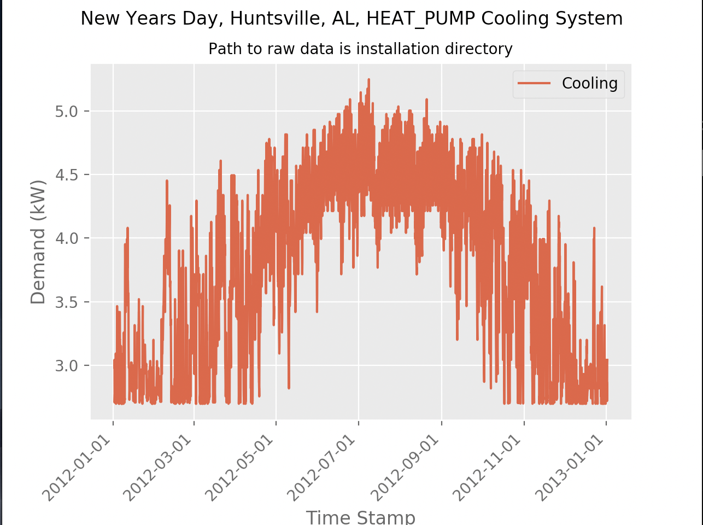
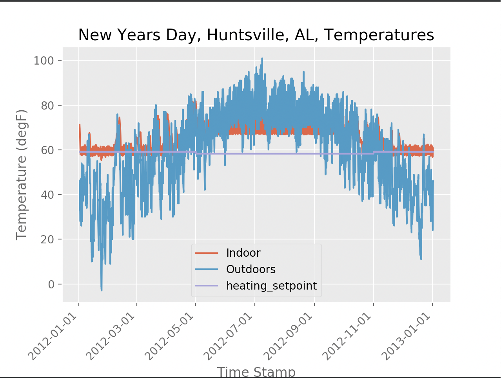

### Description

This software generates load shapes for a given device type. Device types include gas heaters, heat pump heaters, resistance heaters, waterheaters, electric AC units, heat pump AC units, electric vehicles, the non defferable loads refrigerators and freezers, and defferable loads like dryers and clotheswashers. 

### Usage

Install by download (insert URL).

You need some prerequirements:
-pyplot from matplotlib
-argparse
-dates from matplotlib
-pvlib

You can install all of these with pip install <'package name'>

Then run the simulation: `python LoadSimGLD.py <load_type>` where load_type is one of the following: "GasHeat", "HeatPump", "Resistance", "AC_electric", "AC_HeatPump", "Waterheater", "EV", "Refrigerator",  "Clotheswasher", "Dryer", "Freezer".

Output should look like:

### Advanced Usage

Change the climate data by replacing inc_climate.tmy2 with a TYM2 or TYM3 file (add link to where these are on the internet, probably NREL). 

You can change the house energy efficiency metrics (square footage, insulation, glazing, etc.) by editing them in LoadSimGLD.py in the text describing the super_house object. There is a docstring above the object with the label SUPER HOUSE OBJECT BELOW.

To change attributes of loads, you will need to open the in_super_house.glm file to change the attributes of the loads. Only the house load is defined in LoadSimGLD.py. 

There is also a inc_super_schedules.glm file where all of the load shapes are defined, if you want to change how much power a load uses and when, you will have to change this file. 

For more information on this schedule file, and to see where the default power draws were obtained from, you can check out this link https://github.com/gridlab-d/gridlab-d/blob/develop/residential/elcap2010.h

For more information on the gridlabd schedule object, check out this link http://gridlab-d.shoutwiki.com/wiki/Schedule.

For more information on gridlabd powerflow, check out this link http://gridlab-d.shoutwiki.com/wiki/Power_Flow_User_Guide.
