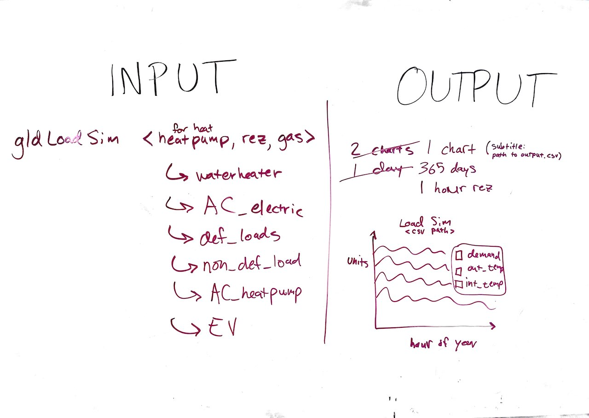

### Description

This software generates load shapes for a given device type. Types include heat pump heater, resistance heater, gas heat (with fan), waterheater, heatpump waterheater, electric AC, deferrable loads, non-deferrable loads, heatpump AC, electric vehicle.

### Usage

Install by download (insert URL).

You need some prerequirements. Install these from (insert list of software).

Then run the simulation: `python LoadsimGLD <load_type>` where load_type is one of (insert load types).

Output should look like:

### Advanced Usage

Change the climate data by replacing inc_climate.tmy2 with a TYM2 or TYM3 file (add link to where these are on the internet, probably NREL).

You can change the house energy efficiency metrics (square footage, insulation, glazing, etc.) by editing them in LoadSimGLD.py.