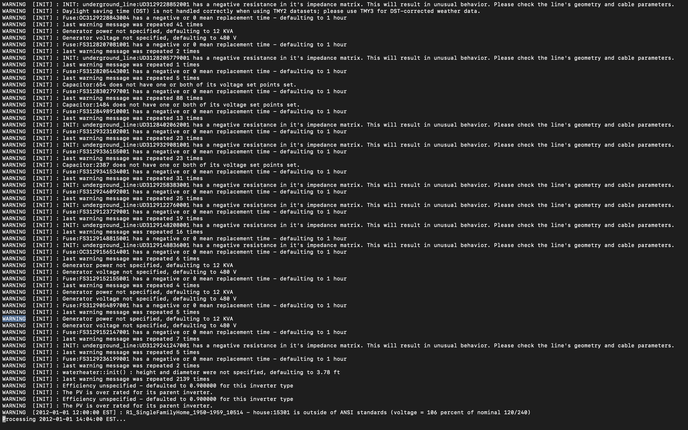
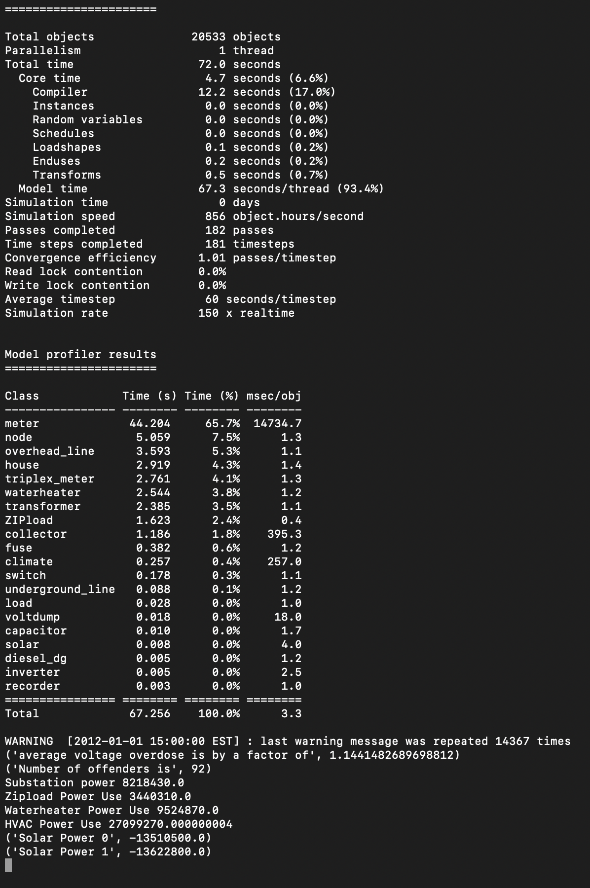
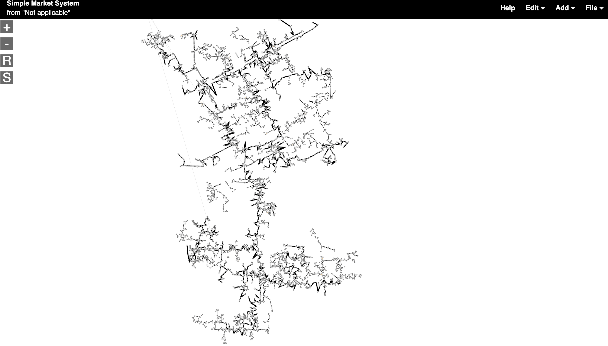
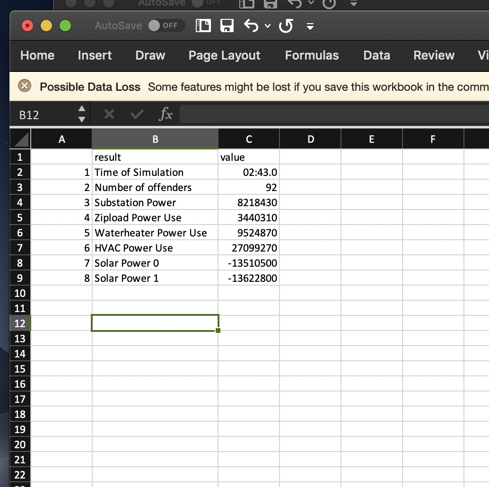
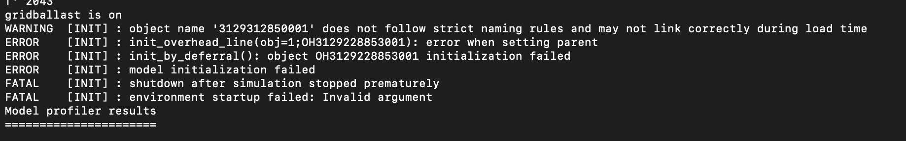

### Overview

TODO: We need to walk user through on linking the gld utility sim binary to solver in omf. 

 The purpose of this module is to track voltage across circuit nodes, determine if any nodes carry excess voltage, and then observe the effect gridballast devices have on voltage. Excess voltage can be defined as when the voltage on the node is more than 105% of rated voltage. For purposes of this simulation, nodes which exceed rated voltage are called 'offenders.' 

 The gridballastVoltReg module works by first simulating powerflow on a circuit with solar generation in GridLAB-D, and then tracking voltage on the circuit. The user can specify if gridballast is enabled or not. Gridballast functionality only exsists for waterheaters and ziploads. If gridballast devices are 'on,' waterheaters and ziploads will turn on based upon the voltage level affecting them. For more information how gridballast works, please check here : .........######.........

 The primary input is a .omd file containing a utility scale circuit. Typically the circuit will include a substation generation source, it should contain house objects, with a water heater, ziploads, and maybe some other objects connected to it. 

 The primary output is a results file aptly name 'Results.csv' saved to the module directory. The Results file contains the powerflow results for HVAC units, waterheaters, ziploads, and generation objects such as solar, wind, and powerflow from the substation. The results file also displays the number of offenders, or nodes carrying excess voltage. 

 Other output files include power use on HVAC, triplex loads, waterheaters, and ziploads at all timesteps in the simulation, a voltDump file with all voltages on all nodes at the first time step, and a chart of the circuit nodes illustrating the voltage differential across them. 

 gridballastVoltReg includes functionality for conventional utility scale solar, and distributed solar electricity generation such as rooftop solar. The motivation behind this module is to ensure that the installation of conventional utility solar OR rooftop solar will not cause undue voltage issues, and if it does, determines if a gridballast device can help reduce excess voltage. 

### Requirements

gridballastVoltReg requires the following: 
-python 2.7  
-gridballast enabled GridLAB-D binary, found at https://github.com/gridballast/utilitySimGB/tree/feature/730  
-python packages json, argparse, pandas, numpy, csv, open modeling framework (omf), re, and datetime.  
-the python packages can be installed via the command terminal `pip install <package_name>`  
-The open modeling framework from https://github.com/dpinney/omf this contains the necessary solver libraries and gridlabd to run simulations

### Usage

To install gridballastVoltReg, please download from .......

To run, simply open a terminal in the gridballastVoltReg directory and type in your terminal `python voltControlUtilityScale.py <path_to_omd> <gridballast status ('on' or 'off')> <keep files (True/False)>` for utility scale simulation. For the distributed solar case `python voltControlUtilityScale.py <path_to_omd> <gridballast status, ('on' or 'off')> <(rooftop solar size in square feet)> <keep files (True/False)>`

You will know the simulation is working correctly when you see the GridLAB-D outputs for each timestep.

The simulation should yield an output similair to what is below. These are the results of the GridLAB-D simulation, but the overall module is far from finished. 

Eventually a window will pop up in your web browswer which will look similair to what is below. This is a visual model of your circuit. 

To view the results of the simulation, simply navigate to the directory of the module and open as a .csv in excel, or which ever text editor you like.

If you want to see which nodes are offenders, simply open offenders.csv in a text editor to view them. 

### Advanced Usage

The binary of GridLAB-D can be found at https://github.com/gridballast/utilitySimGB/tree/feature/730

One common error is GridLAB-D returning an error that a 'parent could not be set.' Below is a screenshot. This is a common error, all you have to do is simply run the simulation again!!

The circuit .omd file needs to specify water demand for the water heaters, and load scheduling for loads. In our simulation, we included "hot_water_demand1.glm" and "schedulesResponsiveLoads.glm" respectively. You can include your own custom schedules or use ours! But you must type, for example, "#include "hot_water_demand1.glm";" at the top of your feeder. For more information on GridLAB-D schedules and includes, read this link: http://gridlab-d.shoutwiki.com/wiki/Schedule 

