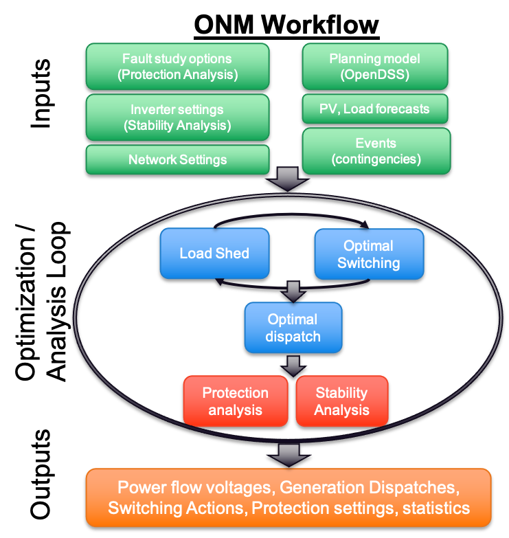

# ONM Workflow

PowerModelsONM is designed to have a straightforward workflow for optimizing the operation and recovering of distribution feeders under contingencies.

In particular, the workflow consists of the following steps (see diagram above):

1. Data processing and preparation
1. Solving an optimal switching (osw) / load shed (mld) problem
1. Solving an optimal dispatch (opf) problem using the optimal configurations
1. Statistical analysis of the combined solution

In this document we outline essentials about each of these steps, but for full exploration of the practicalities, read the [Introduction to PowerModelsONM Tutorial](@ref Introduction-to-PowerModelsONM)

## Data processing

At a minimum, PowerModelsONM requires a network file, in DSS format, with timeseries data (_e.g._, LoadShapes). Without timeseries data, the ONM switching algorithm can still be utilized, but the Optimal Dispatch algorithm will error. For an example of an appropriate network definition, see our [modified IEEE13 feeder](https://github.com/lanl-ansi/PowerModelsONM.jl/blob/main/test/data/IEEE13Nodeckt_mod.dss).

There are several other supplementary files that can be included as well, of which the [events data](@ref Events-Schema) is the most important. This file defines the contingency, by either explicitly defining the switching actions, or by applying a fault to a particular asset (_i.e._, a line).

Another useful file is the network [settings data](@ref Settings-Schema), which is used to define extra information about the network, __not__ related to the timeseries, which cannot be expressed in the DSS format, such as bus voltage magnitude bounds, cold load pickup factors, voltage angle difference bounds, microgrid definitions, etc.

Finally, there are the two inputs for Stability Analysis and Fault Analysis, performed post optimization. For stability analysis, [inverters data](@ref Inverters-Schema) is required for the analysis to produce meaningful results (see, [PowerModelsStability documentation](https://github.com/lanl-ansi/PowerModelsStability.jl)), but for fault analysis, although you can specify faults ahead of time via [fault data](@ref Faults-Schema), it is not necessary because if no faults are specified, a set of faults for analysis will be automatically generated. It should be noted however that a large number of faults will be generated automatically, which could incur serious time penalties in the completion of the algorithm. For more information, see [PowerModelsProtection documentation](https://github.com/lanl-ansi/PowerModelsProtection.jl).

## Optimal Switching Problem (OSW/MLD)

The optimal switching algorithm in ONM is an extension of the single-network MLD problem contained in PowerModelsDistribution, that takes into consideration certain engineering realities of distribution feeders.

First, it should be noted that because loads are most typically not individually controllable in distribution feeders, with a few notable exceptions, loads must largely be shed by isolating a load block with switching actions. A load block is defined as a block of buses which can be fully isolated from the grid by opening one or more _operable_ switches.

To accomodate this reality, we can extended PowerModelsDistribution by adding the ability to assign single load status variables to a collection of loads (_i.e._, by block), and adding constraints that isolate blocks of load that are desired to be shed to maintain operability of the rest of the grid.

Second, the optimal switching problem currently uses the LinDist3Flow model (`PowerModelsDistribution.LPUBFDiagModel`), which is a quadratic approximation, due to the presence of mixed integers.

Finally, the optimial switching problem currently solves sequentially, rather than globally over the entire multinetwork, which means switch configurations and storage energies are manually updated after each timestep is solved.

The mathematical formulation can be found [here](@ref osw-mld-math).

## Optimal Dispatch (OPF)

Because the optimal switching is performed with a) a linear approximation, and b) sequentially, it is necessary to run a subsequent optimal dispatch solve on the resulting optimal configuration to ensure solution feasibility and accuracy.

This nonlinear AC OPF problem is a simple extension of the [AC-OPF problem contained in PowerModelsDistribution](https://lanl-ansi.github.io/PowerModelsDistribution.jl/stable/manual/math-model.html#Unbalanced-AC-Optimal-Power-Flow), a truncated version of which is reproduced [here](@ref opf-math).

## Statistics

After the optimizations have completed, ONM collects essential statistics for our default [output specification](@ref Outputs-Schema). These include:

- a device action timeline, which contains an ordered list of the switch settings and loads shed at each timestep,
- a list of switch changes, _i.e._, switches whose state has changed from the previous timestep,
- microgrid statistics, including
  - minimum, mean, maximum voltages in per-unit representation at each timestep,
  - state of charge of all energy storage at each timestep,
  - details of load served in percent, _i.e._, how much load is supported by the feeder (substation/grid), how much by microgrids, and how much extra load are the microgrids supporting,
  - details of the sources of generation in kW, _i.e._, how much power is coming from the grid, solar, energy storage, or traditional deisel generation, and
- generation dispatch setpoints, both real and reactive.

If small signal stability analysis is performed, an ordered list of whether the configuration at each timestep is small signal stable is available.

Finally, if fault analysis is performed, an ordered list of fault analysis results at each timestep is given, which includes,

- the fault susceptance / conductance,
- both the unbalanced and symmetric (sequence) fault currents at each protection device, and
- the voltage magnitude at each protection device.
